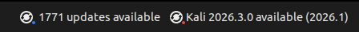

<div align="center">

<p>
  <a href="README.md"></a>
  <a href="https://github.com/yonasuriv/xfce-panel-status/actions"></a>
  <a href="LICENSE"></a>
</p>

<picture>
  <source media="(prefers-color-scheme: dark)" srcset=".github/assets/logo-dark.png">
  <source media="(prefers-color-scheme: light)" srcset=".github/assets/logo-light.png">
  
</picture>

<h3>Panel Status Indicators</h3>

<picture>
  
</picture>

_Let's give XFCE the love it deserves (and Kali, of course ❤️)_

</div>

---

> **Note:** These scripts are tailored for Kali Linux. \
> You are welcome to adjust them as needed and/or upload your own. See "Other distributions" below.

# Kali Panel Status Indicators (XFCE)

Two tiny genmon scripts that keep an eye on your Kali system from the Xfce panel.
One counts the package updates waiting to be installed. The other tells you when
a newer Kali release is out. When there is nothing to report, they print nothing,
so your panel stays clean when the system is up to date.

Both use the **Generic Monitor** (`genmon`) plugin, which ships with Kali's
default Xfce panel.

## Repository layout

```
.
├── kali-themes/                     # the genmon scripts (source of truth)
│   ├── xfce4-panel-update.sh        #   pending package updates
│   └── xfce4-panel-upgrade.sh       #   newer Kali release available
├── setup.sh                         # install/uninstall + panel wiring
└── README.md
```

## Requirements

- **Kali Linux.** The scripts check `/etc/os-release` and refuse to run on
  other distributions.
- **Xfce panel** with **`xfce4-genmon-plugin`** installed. On Kali this ships
  with the default panel, so nothing to install (see *Other distributions*
  for installing it elsewhere).
- **`sudo` access.** The scripts are installed into
  `/usr/share/kali-themes/`, which is owned by root. The `load`/`unload`
  commands only touch your own user configuration and need no privileges.

## Quick start

```bash
./setup.sh install --all --load
```

That one command does everything: it copies both scripts to
`/usr/share/kali-themes/` (using `sudo` automatically, and only when it
actually needs to), adds both indicators at the end of your panel, hides the
label, sets the refresh period to `86400.00 s` (24 hours) and forces them to
render right away. You can run it again as often as you like; existing items
are reused, never duplicated.

## Other distributions

This project is written **for Kali Linux**, and **no other distribution has
been tested**. The two scripts only run Debian-family commands (`apt`,
`sudo -n apt-get update`, `apt show`), and each one checks `/etc/os-release`
and exits silently unless `ID=kali`. On any other distro they will either run
the wrong commands or stay blank on purpose. Using `setup.sh` elsewhere means
**editing the scripts manually** for your package manager and your distro's
`ID`, or adding your own genmon scripts to `kali-themes/`. The panel wiring
itself is plain Xfce `xfconf`, so it works as long as a `genmon` plugin exists.

- **Installing `xfce4-genmon-plugin` on another distro.** See
  [almaceleste's xfce4-genmon-scripts](https://almaceleste.github.io/xfce4-genmon-scripts/),
  which covers installation and examples for several distributions.
- **Looking for more genmon scripts.** See
  [xtonousou/xfce4-genmon-scripts](https://github.com/xtonousou/xfce4-genmon-scripts).

## Commands

| Command      | What it does                                                                 |
| ------------ | ---------------------------------------------------------------------------- |
| `install`    | Copies the selected script(s) from `kali-themes/` to `/usr/share/kali-themes/`, makes them executable (`chmod 755`) and applies the standard genmon settings where applicable. |
| `uninstall`  | Removes the selected script(s) from `/usr/share/kali-themes/`.               |
| `load`       | Wires genmon item(s) into the Xfce panel only. No file changes.              |
| `unload`     | Removes the matching genmon item(s) from the panel only. No file changes.    |

### Options

| Option                   | Only valid with  | What it does                                                                 |
| ------------------------ | ---------------- | ---------------------------------------------------------------------------- |
| `--all`                  | any              | Select every script found in `kali-themes/` (this is the default).            |
| `--only <script>`        | any              | Select a single script by name, e.g. `--only xfce4-panel-update` (`<script>.sh` is also accepted). Available names are listed on mismatch. |
| `--target <path>`        | any              | Deploy to a different **full path** instead of `/usr/share/kali-themes/` (e.g. `--target ~/bin`). Genmon items on `load` then point at that path. Takes precedence over the `KALI_THEMES_INSTALL_DIR` env variable. |
| `--load`                 | `install`        | Shortcut for: install, then `load` as well.                                  |
| `--unload`               | `uninstall`      | Shortcut for: `unload` first, then uninstall.                                |

### Examples

```bash
# Install everything, without touching the panel
./setup.sh install --all

# Install just the updates indicator and add it to the panel
./setup.sh install --only xfce4-panel-update --load

# Remove the upgrades indicator from the panel, then delete the script
./setup.sh uninstall --only xfce4-panel-upgrade --unload

# Install both indicators and wire them into the panel
./setup.sh install --all --load

# Scripts already installed manually; just wire (or re-wire) the panel
./setup.sh load --all

# Unwire the panel without deleting the scripts
./setup.sh unload --only xfce4-panel-upgrade

# Install into your own directory (no sudo needed) instead of /usr/share
./setup.sh install --all --target ~/bin

# Point the panel at scripts deployed elsewhere
./setup.sh load --all --target ~/bin
```

## Scripts

### `xfce4-panel-update.sh` (pending updates)

Refreshes the package cache with `sudo -n apt-get update` and counts the
upgradable packages. Prints the count only when it is greater than zero, e.g.:

```
⇡ 12 updates available
```

Requires passwordless `sudo` for `apt-get update` (see Troubleshooting).

### `xfce4-panel-upgrade.sh` (newer release available)

Kali is a rolling release. The current version is read from `/etc/os-release`
(`VERSION_ID`) and the newest available release from the apt package index
(`kali-linux-core`). **No website is scraped.** When a newer release exists it
prints, e.g.:

```
Kali 2026.3.0 available (2026.1)
```

## Panel wiring and safety

`load`/`unload` (or the `--load`/`--unload` shortcuts) change the panel live
through xfconf (config version 2), the same configuration system the panel
itself uses. Changes apply immediately, no restart required. To keep your panel
safe it does the following:

1. **Back up.** The panel configuration (`xfce4-panel.xml`) is snapshotted
   before anything changes.
2. **Apply.** A genmon item is created and appended to the end of the panel,
   with the label disabled and a period of `86400.00 s`. Each installed script
   gets exactly one item and repeated installs are idempotent. An item counts
   as already installed when its command matches the exact path, or when the
   same script name has an installed copy that is byte-identical (SHA-256) to
   the repo file. So switching `--target` paths, or re-loading after an
   interrupted unload, reuses the existing item instead of creating a second
   one.
3. **Verify and roll back.** Every change is checked afterwards (item present,
   label hidden, period correct). If anything fails, the changes are reverted
   automatically and the panel is left untouched.
4. **Refresh.** Newly loaded items are forced to render immediately. It first
   tries a per-item refresh event, and if the panel ignores it, does a graceful
   panel restart so the output shows up at once instead of waiting for the next
   period. Items you removed from the panel by hand are re-created on the next
   `load`.

On panel configurations that are not `xfconf`-based (old config version 1),
`load`/`unload` refuse to touch anything, print a warning and leave the scripts
installed. Configure the items manually in that case (see below).

## Manual configuration (no `load`)

If you prefer to wire the indicators yourself:

1. Right-click the panel → **Panel → Panel Preferences → Items**.
2. **Add** a **Generic Monitor** for each script.
3. For each item:
   - **Command**: `/usr/share/kali-themes/<script>.sh`
   - uncheck **Label** (only the script output should be shown)
   - **Period(s)**: `86400` (24 hours; stored internally as `86400000` ms)
4. Close the preferences window.

## Advanced environment overrides

| Variable                   | Default                   | Purpose                                           |
| -------------------------- | ------------------------- | ------------------------------------------------- |
| `KALI_THEMES_INSTALL_DIR`  | `/usr/share/kali-themes/` | Where scripts are installed.                      |
| `XFCE_PANEL`               | auto-detected             | Panel to inject into, e.g. `panel-2`.             |
| `XFCONF_CHANNEL`           | `xfce4-panel`             | xfconf channel used by `load` / `unload`.         |

## Troubleshooting

- **Nothing ever shows in the panel.** Verify the script is installed and
  executable (`ls -l /usr/share/kali-themes/`) and that a genmon item in the
  panel points at it.
- **`sudo` password prompt / permission denied during `install`.**
  `/usr/share/kali-themes/` is owned by root. Run `setup.sh` with `sudo`, or
  install to your own directory with
  `KALI_THEMES_INSTALL_DIR=~/bin ./setup.sh install --all`.
- **Built with `sudo`, panel wiring was skipped.** Running `sudo ./setup.sh`
  is supported. The installer resolves the original user's configuration and
  session bus, so `load`/`unload` work through `sudo` too. If it still skips,
  the panel must use `xfconf` (config version 2). For older Xfce versions,
  add the items manually.
- **Updates indicator refreshes but shows nothing.** Check the sudoers rule
  for apt. `/etc/sudoers.d/` must allow `apt-get update` (and only that)
  without a password.
- **Upgrade indicator shows nothing.** The apt package list has to contain
  `kali-linux-core`. Run `sudo apt update` once. If the system is already on
  the newest release the indicator stays empty by design.
- **Duplicate indicators appeared in the panel.** Most likely leftover genmon
  items from an earlier install target path or an interrupted unload. Remove
  them all with `./setup.sh unload --all`, then `./setup.sh load --all` to
  rebuild. To remove by hand: **Panel → Panel Preferences → Items**, select
  each extra **Generic Monitor** and press **Remove**. `load` will not recreate
  them; it reuses items whose installed script is byte-identical, so
  duplicates of the repo scripts are not created again.
- **Stale panel backups.** Backups are kept alongside `xfce4-panel.xml` as
  `xfce4-panel.xml.bak-<timestamp>`. They are safe to delete once you are
  happy with a `load` / `--load`, and they are not used by the panel itself.

## License

Released under the [MIT License](LICENSE).
